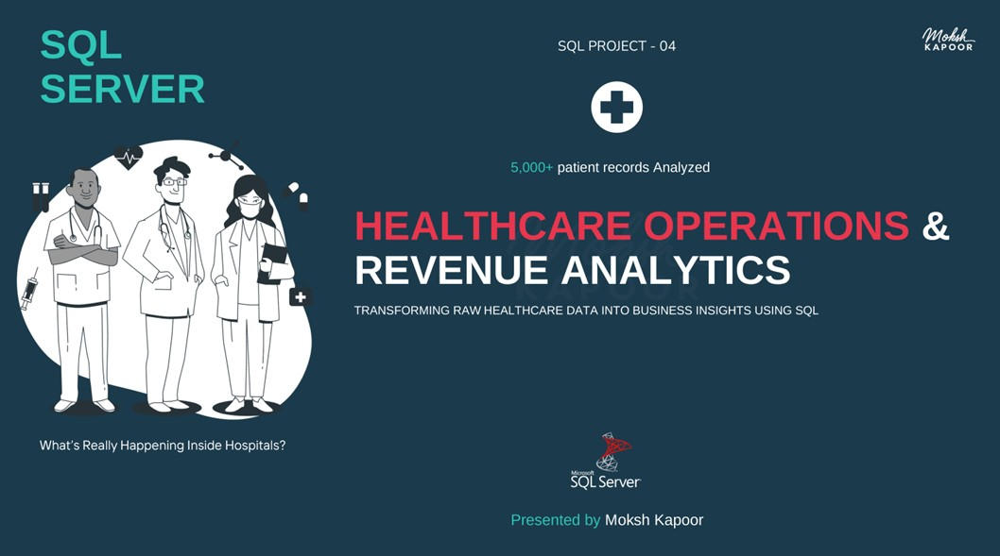

# 🏥 Healthcare Operations & Revenue Analytics | SQL Project

A comprehensive **SQL analytics project** analyzing healthcare operations, patient care trends, hospital revenue, insurance dependency, and provider performance using a multi-table healthcare dataset.

This project transforms raw hospital operational data into actionable insights using **advanced SQL queries, KPI-driven analysis, relational data modeling, and business-focused reporting**.

---

# 📊 Project Overview

This project analyzes **5,000+ patient visit records** representing real-world healthcare operations across:

- Patient admissions & discharge  
- Diagnosis & treatment tracking  
- Insurance coverage & payments  
- Revenue & operational efficiency  
- Provider workload & hospital utilization  

The analysis covers the complete patient lifecycle — from admission to billing and follow-up.

All business insights, KPIs, and operational trends were generated using **pure SQL**.

---

📌 Click on the image to see the working of this project as a presentation  

## 📺 Healthcare Dashboard Screenshot

<a href="https://www.linkedin.com/posts/moksh-kapoor-618495322_healthcare-operations-revenue-analysis-activity-7446779991532503040-lahh?utm_source=share&utm_medium=member_desktop&rcm=ACoAAFGVzjQBQzKnpNzkuOZayyyvYW4FkHnrf28">
  
</a>

# 🧩 Data Model / ERD

## 🗂️ Relational Schema

[](https://www.linkedin.com/posts/moksh-kapoor-618495322_healthcare-operations-revenue-analysis-activity-7446779991532503040-lahh?utm_source=share&utm_medium=member_desktop&rcm=ACoAAFGVzjQBQzKnpNzkuOZayyyvYW4FkHnrf28)

---

# 📁 Dataset Overview

The project uses multiple normalized healthcare tables:

| Table | Description |
|---|---|
| patients.csv | Patient demographics |
| providers.csv | Doctors & provider details |
| departments.csv | Department information |
| diagnoses.csv | Diagnosis classifications |
| procedures.csv | Medical procedure details |
| insurance.csv | Insurance provider data |
| cities.csv | Geographic information |
| visit_cleaned.csv | Visit-level transactional data |

### 📌 Primary Fact Table

- `visit_cleaned.csv`

### 📌 Supporting Dimension Tables

- Patients  
- Providers  
- Departments  
- Diagnoses  
- Procedures  
- Insurance  
- Cities  

---

# 🧹 Data Cleaning & Preparation

## ✔ Excel-Based Cleaning

- Standardized inconsistent date formats into ISO format  
- Cleaned mixed date structures before SQL ingestion  

## ✔ SQL Data Validation

- Corrected admission dates occurring after discharge dates  
- Handled missing values for:
  - Satisfaction scores  
  - Insurance coverage  
  - Room charges  
  - Follow-up dates  

## ✔ Data Quality Checks

- Validated joins across all dimension tables  
- Ensured consistency in payment & revenue records  
- Verified provider and patient relationships  

---

# 🎯 Business Problem & Analysis

Hospitals face ongoing challenges balancing:

- Patient care quality  
- Financial sustainability  
- Operational efficiency  

This project addresses key healthcare challenges such as:

- Rising treatment costs  
- Insurance dependency  
- Uneven provider workload  
- Low follow-up compliance  
- Revenue leakage from pending payments  

The objective is to transform operational healthcare data into measurable KPIs and strategic business insights.

---

# 📊 KPI Framework

## 🏥 Patient & Demand KPIs

- Total Visits & Unique Patients  
- Repeat Visit Rate  
- Emergency Visit %  
- Inpatient vs Outpatient Ratio  
- Average Patient Age  
- Follow-Up Completion Rate  
- Satisfaction Score  
- MoM & YoY Patient Trends  

---

## 💰 Financial & Revenue KPIs

- Total Revenue  
- Revenue per Visit  
- Insurance Coverage %  
- Out-of-Pocket Amount  
- Payment Pending Rate  
- Outstanding Revenue  
- Revenue by Department  
- Revenue per Inpatient  

---

## 👨‍⚕️ Operational KPIs

- Visits per Provider  
- Provider Workload Distribution  
- Average Length of Stay (LOS)  
- Procedure Utilization Rate  
- Satisfaction by Provider  
- Diagnosis-wise LOS  
- Emergency Dependency by City  

---

# 🛠️ SQL Techniques & Concepts Used

## 🔹 SQL Concepts

- SUM(), AVG(), COUNT()  
- CASE WHEN logic  
- CTEs (Common Table Expressions)  
- Subqueries  
- Conditional Aggregations  

## 🔹 Window Functions

- ROW_NUMBER()  
- LAG() for MoM / YoY analysis  
- COUNT() OVER()  

## 🔹 Advanced Analysis

- Multi-table joins  
- Derived KPIs  
- Time-based trend analysis  
- Length of Stay calculations  
- Repeat patient analysis  

## 🔹 Data Handling

- Date standardization  
- Null handling  
- Validation logic  
- Payment filtering  

---

# 📊 Key Insights & Findings

| Insight Category | Finding |
|---|---|
| Patient Trends | Patient volume declined ~36% YoY |
| Emergency Dependency | Emergency visits account for ~38.6% |
| Utilization | Outpatient services dominate (~67%) |
| Follow-Up Compliance | Only ~50% follow-up completion |
| Retention | Repeat visit rate extremely low (~0.52%) |
| Satisfaction | Average satisfaction score ~3.8/5 |
| Revenue Growth | Revenue increased despite lower patient volume |
| Outstanding Revenue | Outstanding revenue critically high (~2.4M) |
| Insurance Dependency | Insurance coverage only ~39% |
| Payment Efficiency | Payment pending rate ~38% |
| Provider Workload | Workload highly uneven across doctors |
| Hospital Capacity | Hospital operates with only 5 doctors |
| Operational Efficiency | Avg Length of Stay ~6.7 days |

---

# 💡 Business Insights

## 🏥 Patient Insights

- Senior patients contribute the largest share of visits  
- Emergency dependency indicates gaps in preventive care access  
- Weak follow-up compliance affects long-term patient retention  

## 💰 Financial Insights

- Higher monetization despite lower patient volume  
- Heavy out-of-pocket burden due to low insurance coverage  
- Outstanding payments create financial sustainability risks  

## 👨‍⚕️ Operational Insights

- Provider workload imbalance increases burnout risk  
- Certain diagnoses drive significantly longer hospital stays  
- Premium room types contribute major revenue share  

---

# 🎯 Strategic Recommendations

- Improve follow-up systems to increase patient retention  
- Expand insurance partnerships to reduce patient burden  
- Optimize provider workload distribution  
- Reduce payment pending rates through faster billing workflows  
- Strengthen preventive care to reduce emergency dependency  
- Improve operational planning for high-LOS diagnoses  

---

# 🔍 Key Learnings

Through this project, I strengthened my skills in:

- Advanced SQL Analytics  
- Multi-Table Data Modeling  
- Healthcare KPI Development  
- Window Functions & CTEs  
- Time Intelligence Analysis  
- Operational Analytics  
- Revenue & Financial Analysis  
- Business Problem Solving  
- Relational Database Querying  

---

# 📂 Repository Structure

```bash
healthcare-operations-revenue-analytics/
│
├── Images/
│   └── Healthcare.jpg
│   └── Healthcare schema.jpg
│
├── SQL Queries.sql
├── README.md
```

---

# 👤 Author

## Moksh Kapoor

📊 Aspiring Data Analyst  

### Skills
SQL • Power BI • Excel • Python

🔗 LinkedIn:  
[Visit My LinkedIn Profile](https://www.linkedin.com/in/moksh-kapoor-618495322/)

---

⭐ If you like this project, consider giving it a **star** on GitHub!
